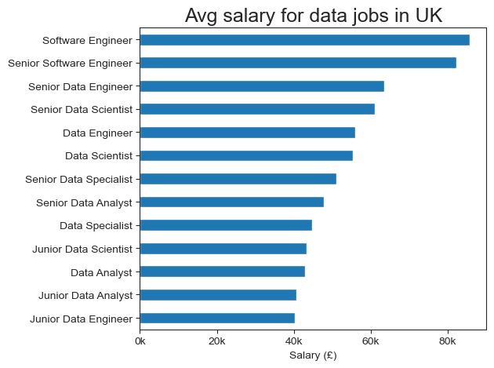
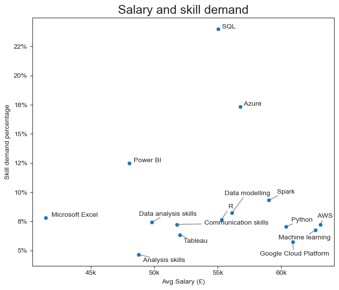

# Project 2 : UK Job posting from Glassdoor 2024

Welcome to my second project. I obtained the dataset from [UK data job 2024 glassdoor](https://www.kaggle.com/datasets/arjunxyz/data-science-jobs-2024-glassdoor-uk).
This dataset contains variables such as job title, company name, salary, employee size, revenue, location, industry. Using excel, SQL, python, I explored relationships among these variables.

# Backgroud

I choosed this dataset to explore UK data job situation. This analysis will help to find data job in UK, such as industry and salary. Also I'd like to see which skill is most demanded.

# Questions

Here are the key questions I explored:

1. EDA
    1) Salary by Job title
    2) Salary by Industry
    3) Salary by Employee size
    4) Salary by Company Revenue

2. Narrow down for 7 most posted data job:
    - Most required skills
    - Required skills and salary
    - Company Rating vs Salary by job title

3. How about Data Analyst job only?
    - Required skills and salary
    - Job posting count and Salary by Industry as DA

# Tools I used

- **Excel** : Initially used to explore NaN values and understand categories. The dataset contains invalide text, so first I did change to unicode, then I removed job describtion and founded year.Also I cleaned text data for better visualization.
- **PostgreSQL**: I used SQL to pull out the job titles that I want to explore. To do so, I create dataset and table, copy data from excel and created new column 'cleaned_job_title'. Also removed other job titles.
- **Python**: I used following libraries:
    - `Pandas` : For data cleaning and analysis.
    - `Matplotlib` and `Seaborn` : For data visualization.
- **Visual Studio Code** : To write and excute python code, including Jupyter Notebooks. Also I used postgresql in VS code.
- **GitHub** : Host and share code and visualizations.

# Data Preparation & Cleaning

I obtained the data in CSV format and fixed unicode and operated initial clean on Postgresql to take out the job titles.

## Import Libraries & Clean Data

Loaded the dataset and performed initial cleaning for analysis. Such as salary adjustment and drop NaN values.


``` python
import pandas as pd
import seaborn as sns
import matplotlib.pyplot as plt  

from adjustText import adjust_text
from matplotlib.ticker import PercentFormatter, FuncFormatter

df_original = pd.read_csv(r'C:\Users\Dell\DA_FILE\100_My_Project\6_UK_Job_glassdoor2024\job_list_cleaned.csv')

sns.set_style('ticks')

# Remove data that dont contain salary
df = df_original.dropna(subset='salary').copy()

# make hourly salary to yearly salary (1950 hours per year)

def make_year(salary):
    if salary<1000:    return salary*1950
    else : return salary

df['salary']=df['salary'].apply(make_year)  

```

# Analysis

## 1. EDA
    1) Salary by Job title
    2) Salary by Industry
    3) Salary by Employee size
    4) Salary by Company Revenue

I wanted to look up average salary of data jobs by variables.

Check my full code here : [EDA for data jobs](6_EDA.ipynb)

### 1) Salary by Job title

```python

df.groupby('cleaned_job_title')['salary'].mean().sort_values().plot(kind='barh')

plt.title('Avg salary for data jobs in UK',fontsize=18)
plt.gca().xaxis.set_major_formatter(FuncFormatter(lambda x, pos : f'{(x/1000):.0f}k'))
plt.xlabel('Salary (£)')
plt.ylabel('')
plt.legend().remove()
plt.tight_layout()
plt.show()

```
### Result



*Bar chart showing average salary of data jobs.*

### Insights:

- Data jobs in UK get more than £40K and software engineers are get higher pay compare to data jobs.


## 2. Narrow down for 7 most posted data job:
    - Most required skills
    - Required skills and salary
    - Company Rating vs Salary by job title

By job title, I wanted to explore 7 most posted job in depth.
Check my full code here : [Top 7 jobs analysis](7_top7_jobs.ipynb)


- Required skills and salary

```python
top_7 = list(df.groupby(['cleaned_job_title'])['salary'].count().sort_values(ascending=False).head(7).index)
df_top7= df[df['cleaned_job_title'].isin(top_7)].copy()

# Separate skill lists to count each skill
df_top7['skill_list'] = df_top7['skills'].str.split(',')
df_skills = df_top7.explode('skill_list')
df_skills['skill_list'] = df_skills['skill_list'].str.strip()

df_skills_sal = df_skills.groupby('skill_list').agg(
    skill_count = ('skill_list', 'size'),
    avg_salary = ('salary','mean')
).sort_values(by ='skill_count', ascending =False).head(15).sort_values(by='avg_salary',ascending=False)

df_skills_sal['percent']= df_skills_sal['skill_count'].div(len(df_top7)/100)


plt.figure(figsize=(7,6))
sns.scatterplot(data=df_skills_sal, x= 'avg_salary', y= 'percent')

texts = []
for i, txt in enumerate(df_skills_sal.index):
    texts.append(plt.text(df_skills_sal['avg_salary'].iloc[i],df_skills_sal['percent'].iloc[i],  " " + txt))

# Adjust text to avoid overlap and add arrows
adjust_text(texts, arrowprops=dict(arrowstyle='->', color='gray'), expand=(1,2))

plt.ylabel('Skill demand percentage')
plt.title('Salary and skill demand',fontsize=18)
plt.gca().xaxis.set_major_formatter(FuncFormatter(lambda x, pos : f'{(x/1000):.0f}k'))
plt.xlabel('Avg Salary (£)')
plt.gca().yaxis.set_major_formatter(PercentFormatter(decimals=0))
plt.tight_layout()
plt.show()

```
### Result



*Scatter plot to see relation between skill demand and salary*

### Insights:

- SQL is most demanded skill, as more than 22% of job posting requires, however it is not the highest paying skill.
- Also they require to have communication skill.


## 3. How about Data Analyst job only?
    - Required skills and salary
    - Job posting count and Salary by Industry as DA

Look up dataset of Data Analyst.

Check my full code here : [DA Analysis](8_DA_analysis.ipynb)


```python
sns.scatterplot(data=df_DA_skills_sal,y='percent', x='avg_salary')

texts = []
for i, txt in enumerate(df_DA_skills_sal.index):
    texts.append(plt.text(df_DA_skills_sal['avg_salary'].iloc[i],df_DA_skills_sal['percent'].iloc[i],  " " + txt))

# Adjust text to avoid overlap and add arrows
adjust_text(texts, arrowprops=dict(arrowstyle='->', color='gray'), expand=(1.2,1.5))

plt.ylabel('Skill demand percentage')
plt.title('Salary and skill demand as DA',fontsize=18)
plt.gca().xaxis.set_major_formatter(FuncFormatter(lambda x, pos : f'{(x/1000):.0f}k'))
plt.xlabel('Avg Salary (£)')
plt.gca().yaxis.set_major_formatter(PercentFormatter(decimals=0))
plt.tight_layout()
plt.show()


```

### Result


*Scatter plot showing salary and skill demand percentage.*


### Insights:
- As Data Analyst, SQL, Excel, Power BI are most required.


# What I learned
I learned about data job in Uk such as required skills and popular industry. Also I learned PostgreSQL to clean string data.

- PostgreSQL : Starting from builing database and creat table to clean the job title columns, I found it is easy to clean string data and take out only data that I want.

- Python : Utilizing libraries such as Pandas, Seaborn and Matplotlib for major data manipulation and visualization. I tried scatter plot to show 2 numeric datas and placed name in the chart.

- Data Cleaning : I started with Excel for initial data inspection and cleanup, then I copyed the data to SQL. In SQL, I cleaned string data to pull out the title that I want.

- Data Exploration Strategy : As I learned from first project, this time I planed explorations. Following my plan and also added a few analysis that I found intresting. 


# Insights

This project revealed usuful information of data jobs in UK. 

- Data jobs in UK get more than £40K and software engineers are get higher pay compare to data jobs.
- SQL is most demanded skill, as more than 22% of job posting requires, however it is not the highest paying skill.
- Also they require to have communication skill.
- As Data Analyst, SQL, Excel, Power BI are most required.


# Challenges I Faced

- Data cleaning : Using SQL to clean up string data, need to make sure every data that I want was pulled 
- Complex Data Visualization : Tried scatter plot and to ensure easy to see the analysis, I need to narrow down data. Also pay attantion to visualization.
- Data correlation : To correct correlation, I performed count function to check if there is enough data to manipulate. 


# Conclusion

The analysis provide idea of salay by job title and which skills to learn. Additionally able to look up by industry of job. 