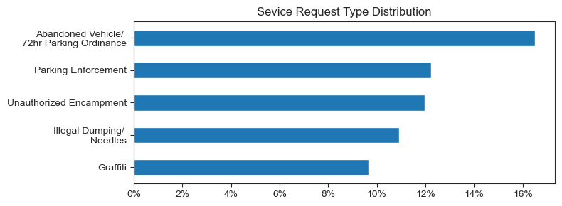
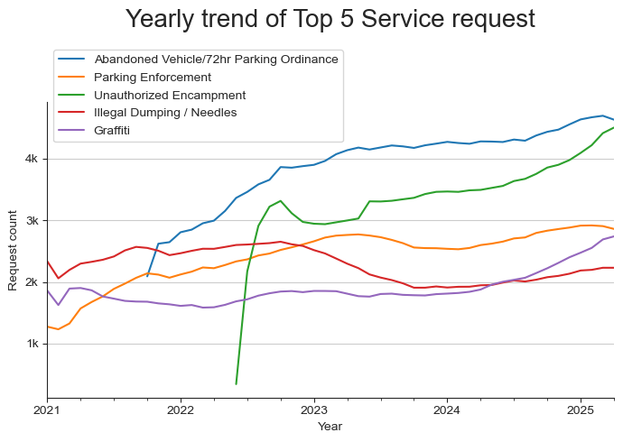
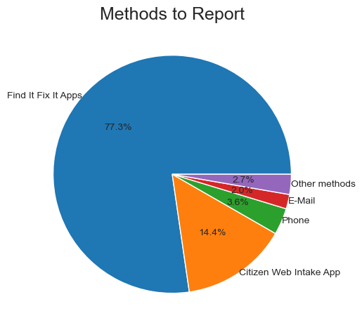
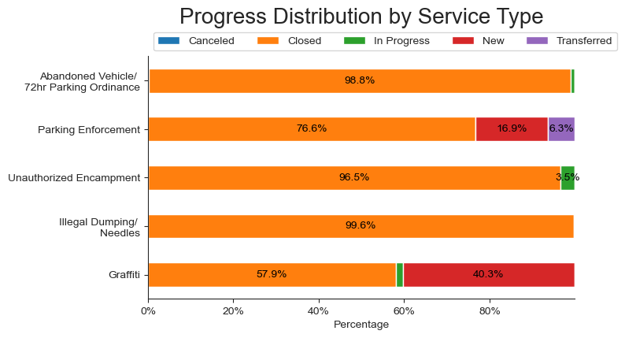

# Project 4 : Seattle customer service request analysis

## Overview
In this project, I analyze Seattle service requests from 2021 to the present(2025).

The dataset resource is [here](https://catalog.data.gov/dataset/customer-service-requests). 

I used Python to explore relationships between variables.

## Questions to Answer

1. What are the most requested services?
2. How is service request distribution by Zip code?
3. What are the yearly trends in service requests?
4. Which methods are most commonly used by citizens?
5. What is the status of progress?
## Analysis Approach
#### Import Libraries and Clean Data
I loaded the dataset and performed initial cleaning for analysis.

```python
import pandas as pd
import seaborn as sns
import matplotlib.pyplot as plt  

from matplotlib.ticker import PercentFormatter, FuncFormatter

# import Zip code as string
df_original = pd.read_csv(r'C:\Users\Dell\DA_FILE\100_My_Project\8_Service_request\Customer_Service_Requests.csv', dtype={12 : object})

sns.set_style('ticks')

# Remove unnecessary columns
df = df_original[['Service Request Number', 'Service Request Type', 'City Department',
       'Created Date', 'Method Received', 'Status',  'ZIP Code']].copy()
df.loc[:,'date'] =pd.to_datetime(df['Created Date'])

```


### 1. What are the most requested services?
- To begin the analysis, I explored which service were most frequently requested. I created a DataFrame grouped by `Service Request Type`, calculated the distribution as percentage, limited the data to the top 5 types and visualized it using a horizontal bar chart.

Check my full code  [here](0_Intro.ipynb)

```python

df_type = df.groupby('Service Request Type')['Service Request Number'].count().reset_index().sort_values(by='Service Request Number',ascending=False)
df_type['percent'] = df_type['Service Request Number'].div(len(df)/100)

df_type.head().plot(kind='barh',y='percent', x='Service Request Type', figsize=(8,3))

plt.gca().invert_yaxis()
plt.title("Sevice Request Type Distribution (%)")
plt.legend().remove()
plt.ylabel("")
plt.gca().set_yticklabels(legend_labels)
plt.gca().xaxis.set_major_formatter(PercentFormatter(decimals=0))
plt.tight_layout()
plt.show()

```

**Visualization:**



**Insight:**

Seattle receives many parking-related complaints. 
Services like 'Abandoned Vehicle/ 72hr Parking Ordinance'and 'Parking Enforcement' indicate that citizens report both long-term and short-term parking issues.

### 2. Service Request Distribution by Zip Code
- To understand geographic distribution, I analyzed service request counts by zip code and show as a map with `Plotly` library.

Check my full code  [here](1_Zip_code.ipynb)

```python
import plotly.express as px
import json

with open(r'C:\Users\Dell\DA_FILE\100_My_Project\8_Service_request\zip-codes.geojson', 'r') as f:
    geojson_data = json.load(f)
print(geojson_data['features'][0]['properties']) 
# validate property fields  :GEOID10


df_zip = df.groupby('ZIP Code')['Service Request Number'].count().reset_index().sort_values(by='Service Request Number',ascending=False)

fig = px.choropleth_map(
    df_zip, 
    geojson=geojson_data, 
    locations='ZIP Code', 
    title='Service Request Distribution in SEATTLE',
    color='Service Request Number', # color based on request count
    featureidkey='properties.GEOID10',# matching key
    color_continuous_scale="YlOrRd", #set most requested place as Red.
    map_style="carto-positron",
    zoom=9.5, center = {"lat": 47.61, "lon": -122.33}, # show Seattle
    opacity=0.8
     )
fig.update_geos(fitbounds="locations", visible=False)
fig.update_layout(margin={"r":0,"t":40,"l":0,"b":0}, 
                  coloraxis_colorbar=dict(title="Total Request Count"),
                  title={'xanchor': 'left', 'font': {'size': 24}},
                  width=600, height=600 )
fig.show()


```

**Visualization:**


**Insight:**


### 3. What are the yearly trends of service requests? 
- To view trends over time, I aggregated the dataset by YYYY-MM, then removed noise and smoothed visualization by applying rolling window.

Check my full code  [here](2_Yearly_trend.ipynb)

```python

df_pivot =df.pivot_table(values='Service Request Number',aggfunc='count',index='year', columns='Service Request Type')
df_pivot = df_pivot[top5]

# Plot with previous 12 months average 
df_pivot_smooth =df_pivot.rolling(window=12, min_periods=1).mean()
df_pivot_smooth.plot(figsize=(7,5))

plt.gca().yaxis.set_major_formatter(FuncFormatter(lambda x, pos : f'{(x/1000):.0f}k'))
plt.subplots_adjust(left=0.1, right=0.95, top=0.95, bottom=0.1)
sns.despine()
plt.legend(loc='upper left',  bbox_to_anchor=(0, 1.2))
plt.title('Yearly trend of Top 5 Service request',fontsize=20, pad=60)
plt.ylabel('Request count')
plt.xlabel('Year')
plt.grid(axis='y')
plt.tight_layout()
plt.show()

```


**Visualization:**



**insight:**

- Unauthorized Encampments have surged since mid-2022 and became top request in 2025.
- Parking-related issues have doubled since 2021, especially long-term parking complaints.


### 4. Which methods are most commonly used by citizens? 
- I counted the number of requests by method. Preserving top 4 methods and grouped rest of them as 'Other methods'.
Check my full code  [here](3_Method.ipynb)

```python
df_method = df['Method Received'].value_counts().sort_values(ascending=False)
df_method.loc['Other methods']= df_method.iloc[4:].sum()
df_method = df_method.drop(df_method.index[4:-1])

```

**Visualization:**



**Insight:**

- Majority of reports are submitted through the **Find It Fix It app**, followed by the **Citizen Web Intake app**.

### 5. What are the status of progress? 
- I analyzed the progress of service requests using a stacked horizontal bar chart to display the distribution of status by service type. 

```python

df_status_type = df.pivot_table(index='simple_stat',values='date',aggfunc='count',columns='Service Request Type').T
df_status_type['sum']=df_status_type.sum(axis=1)

# Convert to percentage
for col in df_status_type.columns :
    df_status_type[col]=df_status_type[col].div(df_status_type['sum']/100)

df_status_type.drop(labels='sum',axis=1,inplace=True)

ax = df_status_type.plot(kind='barh', stacked=True,figsize=(7,4))

plt.legend(ncol=5, bbox_to_anchor=(0, 1),loc='lower left')
plt.title('Progress Distribution by Service Type',fontsize=20,pad=30)

for container in ax.containers:
     labels = [f'{v.get_width():.1f}%' if v.get_width() > 3 else '' for v in container]
     ax.bar_label(container, labels=labels,label_type='center', fontsize=10, color='black')

plt.ylabel('')
plt.gca().xaxis.set_major_formatter(PercentFormatter(decimals=0))
sns.despine() 
ax.invert_yaxis()
plt.xlabel('Percentage')
plt.show()

```


**Visualization:**



**Insight:**

- Graffiti has the highest proportion of New status, followed by short-term parking issues.
- Long-term parking and Illegal Dumping/Needles issues have mostly been addressed.


## Insight

1. Parking-related issues are the most frequently reported in Seattle.
2. A majority of requests are addressed.
3. Unauthorized Encampment are on the rise,especially in zip code 98107.
4. The total number of service requests has nearly doubled compared to 2021

## Technical Details
- **Python:** I used following libraries :
    - `Pandas` : To clean and analyze data
    - `Matplotlib` and `Seaborn` : Data visualization
    - `Plotly` : Display analysis as a map 


## Challenges I Faced and What I Learned 
- **Understanding Local Context :**
 The dataset is the concerns of Seattle citizens. To analyze it successfully, I had to consider the perspective of the citizens and what issues would be matter to them. I learned that parking problems are through out Seattle, and also unauthorized encampments have become a bigger problem. Also I can assume that many of requests are addressed.

- **Map Visualization :**
 To show the distribution by zip code, I used a map. In this visualization, I learned the importance of limiting the amount of data to avoid overwhelming the visualization. Performing this project helped me complex visualization skills using `Plotly`, especially with the `choropleth_map` function.

- **Data Limitations :** 
While the dataset includes a `Status` field, it doesn't contain closed dates or other detailed status update. This made it difficult to track service request resolution over time. Without closed dates, I couldn't fully analyze the timely efficiency. This taught me the process of acquiring data is a very important step in completing an analysis.

- **Extracting Meaningful Insight :** 
I have explored more relationships between variables or deeper in particular variables. However, I realized the importance of staying focused on finding meaningful insight. I learned that understanding the dataset's strengths and limitations will provide me clearer goals and more appropriate analysis.
