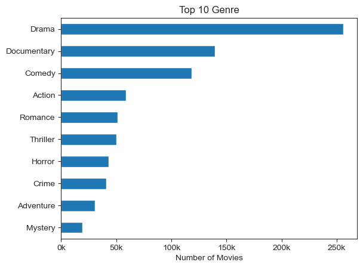
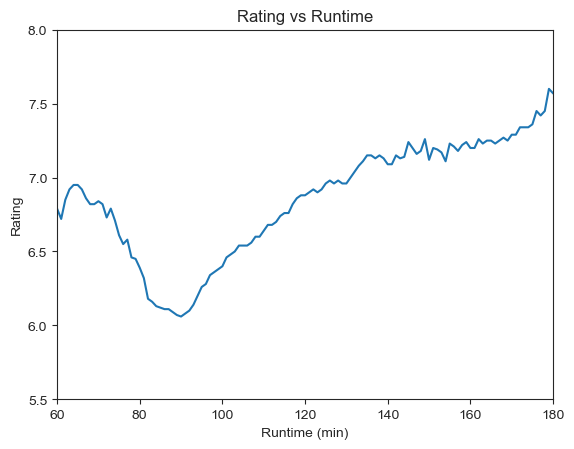
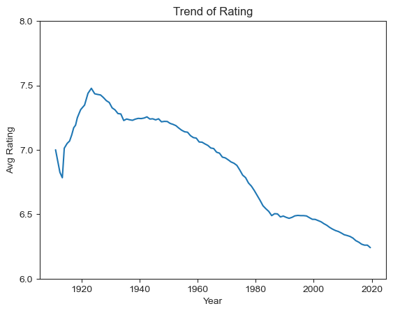
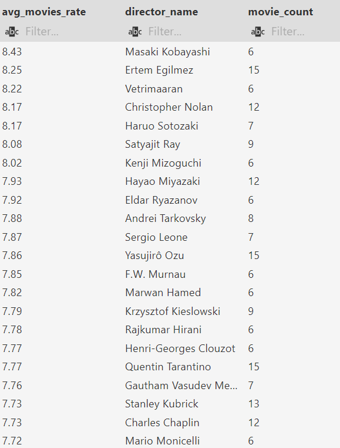
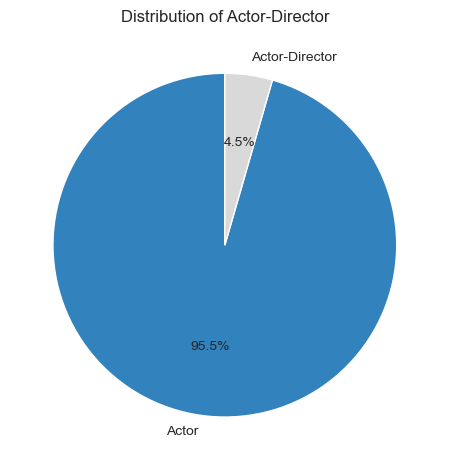

# Introduction
Welcome to my Project 5 : IMDb Analysis.
I'll analyze a dataset from the [IMDb link](https://developer.imdb.com/non-commercial-datasets/) as of 28/Apr/2025.

I chose to analyze the IMDb dataset to explore the relationship between ratings, directors, and genres of movies over the years using SQL.

The dataset consists of 7 tsv files. However, I will not use the episode dataset since I'll focus on the movie dataset.

With these tsv files, created a database and tables. 
Since they are multiple tables, I'll conduct several `JOIN` operations and use `CTE`.

I created a detailed analysis plan to capture the proper data that I need.
Check out my analysis plan [here](4_Analysis_plan.md)

# Tools I Used

- **PostgreSQL :** 
	- From creating the database to analysis, I used PostgreSQL in VS Code.
	- Conducted statistical functions such as median, average, max, min and count. To connect each table, I used `INNER JOIN` and `LEFT JOIN`.
	- To convert lists to strings, I used `UNNEST`.

- **Python :** 
	- `Matplotlib`,`Seaborn`, and `Pandas` for visualization.
	- `Psycopg2` to connect with the SQL Database.


# The Anlaysis
I focused on 5 main variables : Runtime, Rating, Genre, Director and Actors.

I created a database in PostgreSQL and imported tsv files as each table, also saving them as backups.

For better analysis, I altered the tables by dropping unnecessary data.
Check my full code [3_alter_tables](3_alter_tables.sql)

I'll analyze the dataset in PostgreSQL, then plot a few charts using python.


### 0. EDA
#### Distribution of genres
Explored the most popular genres in the dataset by counting the number of each genre.

**Methodology :**

Create CTE to explode genres to each row and assigned as `genre_explode_table`.
Count number of each genre and display with genre name, and total number as descending order.
Then display the top 10 genres in a horizontal bar chart.

Check my full code [5_EDA](5_EDA.sql)
	
```sql
WITH genre_explode_table AS(
SELECT title_id, 
       UNNEST (string_to_array(genres, ',')) AS genre_explode
FROM title_basics
)

SELECT genre_explode,
       COUNT(genre_explode) 
FROM genre_explode_table
GROUP BY genre_explode
ORDER BY COUNT(genre_explode) DESC;
```

**Visualization:**



A horizontal bar chart with number of movies per genre.

**Insight :**

Drama genre movies are the most common, about 250k movies, followded by Documentary(150k) and Comedy(130k).

### 1. Runtime

#### Is there a relationship between runtime and rating?
Explored whether longer runtime movies tend to get higher ratings or shorter runtime movies perform better. Consider only common runtime as 60 minutes to 180 minutes.

**Methodology :**

Filtered where runtime is not null and number of votes is greater than average votes number(3630).
Joined the ratings and runtime tables on `title_id`, and created a CTE as `runtime_rating`.
Calculated the average rating for each runtime.

Check my full code [6_Runtime](6_Runtime.sql)
	
```sql
WITH runtime_rating AS(
SELECT title_basics.title_id,
        runtime_min,
        title_rating_alter.avg_rating
FROM title_basics
INNER JOIN title_rating_alter ON title_basics.title_id = title_rating_alter.title_id
WHERE runtime_min IS NOT NULL AND (title_rating_alter.votes_num >3630)
)

SELECT runtime_min, percentile_cont(0.5) WITHIN GROUP(ORDER BY avg_rating) AS average_rating 
FROM runtime_rating
GROUP BY runtime_min
```

**Visualization:**



This chart shows the average rating by runtime, from 60 to 180 minutes.

**Insight :**

Interestingly, 90 minutes movies have the lowest rating.
The rating increases with longer runtime, reaching higher for 180 mins runtime movies. 

### 2. Rating
#### Rating over the years
Investigate if people's movie ratings have changed over time.

**Methodology :**

Grouped movies by `start_year` and joined them with the rating table.
Calculated the average rating per year and show with 2 decimals.
To ensure validity, filtered titles that have more than 3630 votes. 

Check my full code [7_Rating](7_Rating.sql)
	
```sql
SELECT start_year AS released_year,
       ROUND(AVG(avg_rating),2) AS avg_rating
FROM title_basics
INNER JOIN title_rating_alter AS rating
            on title_basics.title_id = rating.title_id
WHERE votes_num> 3630
GROUP BY start_year;
```

**Visualization:**



Average rating of movies by year.

**Insight :**

Average rating of movies have been steadily going down over the years.
In 1930, highest as 7.5, but now the average rating is the lowest as below 6.5.

### 3. Genre

#### Genre distribution by year
Explored if there are preferred genres by year.

**Methodology :**

Unnested genres and grouped them by year and genre. 
Displayed the total count of movies for each genre and year

Check my full code [8_Genre](8_Genre.sql)
	
```sql

WITH genre_explode_table AS(
SELECT title_id, primary_title,start_year,
       UNNEST (string_to_array(genres, ',')) AS genre_explode
FROM title_basics
)
SELECT start_year, genre_explode,
        COUNT(genre_explode)
FROM genre_explode_table
WHERE start_year IS NOT NULL
GROUP BY start_year, genre_explode
ORDER BY genre_explode, start_year
```

**Visualization:**


Top 5 genre's trend over the years. 

**Insight :**

Overall Drama genre movies have been most beloved. 
Documentary genre has become the most popular in recent years, surpassing other genres.


### 4. Director

#### Top directors by rating
Investigate who has made top-rated movies.

**Methodology :**
From title_crew table, unnest directors to each row.
Join with title_rating using `title_id` as a key, to find out average rating for each directors.
Use `vote number > 3630`, and display top 50 directors.
Limit the directors who have made more than 5 movies.

Check my full code [9_Director](9_Director.sql)
	
```sql

WITH director_table AS(
SELECT title_crew_alter.title_id,title_rating_alter.avg_rating,
       UNNEST (string_to_array(directors, ',')) AS director_explode
FROM title_crew_alter
INNER JOIN title_rating_alter ON title_crew_alter.title_id= title_rating_alter.title_id
WHERE votes_num> 3630
)
SELECT  ROUND(AVG(avg_rating),2) AS avg_movies_rate, 
        primary_name AS director_name,
        COUNT(director_explode) AS movie_count
FROM director_table
LEFT JOIN name_basics ON director_table.director_explode=name_basics.name_id
GROUP BY primary_name
HAVING COUNT(director_explode) >5
ORDER BY avg_movies_rate DESC
LIMIT 50;

```

**Result:**



Display the average rating of their movies and director name.

**Insight :**
For current directors, both 'Christopher Nolan' and 'Haruo Sotozaki' have average rating of 8.17. 
'Hayao Miyazaki' follows closely with average rating of 7.93.

### 5. Actor

#### Distribution of actors who have experience as directors
Find out how may actors have also worked as directors?

**Methodology :**

Filter for professions that include actor or director then counted the number of people with those professions.

Check my full code [10_Actors](10_Actors.sql)
	
```sql

SELECT COUNT(name_id) AS total_actors
FROM name_basics
WHERE profession LIKE '%actor%' OR profession LIKE '%actress%'
-- Total number of actors : 5,315,614

SELECT COUNT(name_id) AS actor_director
FROM name_basics
WHERE (profession LIKE '%actor%' OR profession LIKE '%actress%') AND (profession LIKE '%director%')
-- Total number of actor-directors : 237,544

```
**Visualization:**



Pie chart of Actor-Director distribution.

**Insight :**

Approximately 4.5% of actors have also worked as directors.


# Insight
- Drama genre movies are the most common over the years, suggesting it is the most popular genre.
- 90 minutes of runtime movies are the lowest-rated movies, while longer movies tend to receive higher ratings.
- Overall movie ratings have decreased over the years. As of today, the average rating is the lowest under 6.5, which could indicate that viewers have higher standards on movies.
- All of the number of top 5 genre movies have highly increased since 2000. In recent years, Documentary genre has the highest number.
- Considering the total number of movies, many viewers tend to started watch Documentary movies as well since 2000.
- Around 4.5% of actors have also worked as directors.

# Challenges I Faced
- **Handling Large Datasets :** These datasets contain millions of rows.
Queries on large datasets could take minutes to process, and cleaning the data before analysis was crucial for an efficient process.
- **`JOIN` Clause :** Joining each table required careful attention to ensure valid analysis.

# What I Learned
- From Dataset:
	- Longer runtime movies could be a better choice than 90 mins runtime movies.
	- These days, the ratings are continuously going down, viewers are likely have higher standards compare to the past.
	- Drama is the most popular genre, however Documentary genre is also becoming popular.
- Analysis Skills :
1. I deepened my SQL skills, such as choosing the appropriate `JOIN` function and unnesting lists to strings.
2. Using `Psycopg2`, I learned how to bring SQL queries into JupyterNotebook and plot charts using python.
3. Along with `JOIN` clause, creating efficient CTEs can make a significant difference in query time and readability. 
4. Skewed Dataset : This datasets are large enough to see skew, and it is right-skewed dataset. I realized that confirming if the dataset is skewed at the beginning of the analysis helps in choosing the correct statical functions to use.

# Closing Thoughts
- Through the IMDb dataset, I learned that SQL is powerful with functions like `JOIN` and `GROUP BY`. 
CTEs are also very useful for conducting complex analyses.
- For quicker query results, I used the `LIMIT` function.
 With large datasets, the `LIMIT` function is key to speeding up the analysis.
`Psycopg2` was convenient for bringing SQL queries into Python. 
By doing so, it was easy to visualize the analysis results. 
Also it helped to explore dataset in python.
- Additionally, having a detailed analysis plan is one of the most important steps in the whole process. 
After reviewing the dataset, I planned which analyses I like to continue with and then altered tables accordingly. 
Dropping unnecessary data made the queries faster and more readable.


